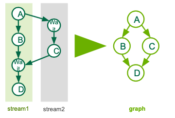
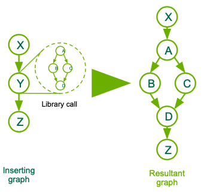

# CUDA Graphs

In this homework we will look at two different codes, both using Cuda Graphs. These codes consist of small kernels and could see some benefit from Cuda Graphs given the particular workflow. The two codes are axpy_stream_capture and axpy_cublas, each having a verison with_fixme and from_scratch. We recommend starting with the with_fixme versions of the two code, and then trying the from_scratch if you want a challenge. The with_fixme versions will have spots where you will need to fix to get the code to run, but the framework is all set in place. The from_scratch versions require you to implement the graph set up and logic by hand.

You can refer to the solutions in the Solutions directory for help/hints when stuck.

### Task 1
#### Stream Capture
This task will be an example of how to use stream capture with Cuda Graphs. We will be creating a graph from a sequence of kernel launchs across two streams.

We will be looking to implement the following graph, which can be helpful to see visually:



This is the same example from the slides, feel free to refer to them for help and hints.

Go ahead and take a look at the code now to get a sense of the new Graph API calls. On first pass, ignore the Graph APIs and try get a feel for the underlying code and what it is doing. The kernels themselves are not doing any specific math, but simply represent some random small kernel. Remember to think about the function of the two streams and refer back to the picture here to make sure you see the inherient dependencies created by the Cuda Events. 

`bool graphCreated=false;` will be our method to set up the graph on the first pass only (for loop iteration 0), then go straight to launching the graph in each subsequent iteration (1 - (N-1)). 

An important distinction is the difference between the type `cudaGraph_t` and `cudaGraphExec_t`. `cudaGraph_t` is used to define the shape and the arguments of the overall graph and `cudaGraphExec_t` is a callable instance of the graph, which has gone through the instantiate step. 

First, to compile the code on Summit:

```
module load cuda/11.4.0
nvcc -arch=sm_70 axpy_stream_capture_with_fixme.cu -o axpy_stream_capture_with_fixme
```

We are compiling the code for the GPU architecture being used (Volta SM 7.0 in this case). Cuda Graphs has been included in all Cuda Toolkits after Cuda 10, but some features may be version-dependent.

To run your code, we will use an LSF command:

```
bsub -W 10 -nnodes 1 -P <allocation_ID> -Is jsrun -n1 -a1 -c1 -g1 ./axpy_stream_capture_with_fixme
```

Alternatively, you may want to create an alias for your bsub command in order to make subsequent runs easier:

```
alias lsfrun='bsub -W 10 -nnodes 1 -P <allocation_ID> -Is jsrun -n1 -a1 -c1 -g1'
lsfrun ./axpy_stream_capture_with_fixme
```

To build your code on NERSC's Cori-GPU

```
module load cgpu cuda/11.4.0
nvcc -arch=sm_70 axpy_stream_capture_with_fixme.cu -o axpy_stream_capture_with_fixme
```

To run during the node reservation (10:30-12:30 Pacific time on October 13):
```
module load cgpu cuda/11.4.0
srun -C gpu -N 1 -n 1 -t 10 -A ntrain2 --reservation=cuda_graphs -q shared -G 1 -c 1 ./axpy_stream_capture_with_fixme
```

or grab a GPU node first, then run interactively:
```
module load cgpu cuda 
salloc -C gpu -N 1 -t 60 -A ntrain2 --reservation=cuda_graphs -q shared -G 1 -c 1
srun -n 1 ./axpy_stream_capture_with_fixme
```

To run outside of the node reservation window:
Same steps as above, but do not include "*--reservation=cuda_graphs -q shared*" in the srun or salloc commands.

FIXMEs
1. cudaGraphCreate(FIXME, 0);
2. cudaGraphInstantiate(FIXME, graph, NULL, NULL, 0);
3. graphCreated = FIXME;
4. cudaGraphLaunch(FIXME, streams[0]);

After you have complete the FIXME, you can see a time printed out after you run. This is the total time from running the graph 1000 times. You can compare that to the time from file axpy_stream_capture_timer.cu, which is the same code running the Cuda work in streams instead of the graph. These examples are primarily to introduce the topic and API, so they are not particularly performant. Given this, you should still be able to see a small preformance increase using the graph from the launch overhead savings. The instantiation phase is not included in the timing however, so it is not exactly a apple-to-apples comparison. It merely highlights the ideas we saw in the slides. 


### Task 2
#### Explicit Graph Creation w/ Library Call
In this task, we will look at a few of the explicit graph creation API and how to capture a library call with stream capture. A key to this example is remembering while we are using both explicit graph creation and stream capture, both are just ways of defining to a `cudaGraph_t` which we then instantiate into a `cudaGraphExec_t`. 

We are creating 2 kernel nodes and a child graph derived from a cuBLAS axpy function call. See the diagram below for a visual.  



https://docs.nvidia.com/cuda/cuda-runtime-api/group__CUDART__GRAPH.html

This is the documentaion of the current Cuda toolkit graph management API. You can complete this example without consulting the docs by using the slides and context clues in the code, or but taking a look at the definition of `cudaGraphAddChildGraphNode` may help you if you are stuck with the FIXME.

Unlike the first example, this code is harder to "get the picture" by ignoring the graph API. Infact, without the graph API calls, there is no runnable program! This level of code change adds a lot of control at the price of code change and loss of readability for users unfamilar with Cuda Graphs. 

The API is a bit tricky because it is quite different from anything else in Cuda at first, but the patterns are actually quite familar. It is just a different way to define Cuda work. 

We will follow the same instructions as before to compile, plus this time adding -lcublas to include the library. 

```
nvcc -arch=sm_70 -lcublas axpy_cublas_with_fixme.cu -o axpy_cublas_with_fixme
```

Using the alias we created for Summit, we can run as follows:

```
lsfrun ./axpy_cublas_with_fixme
```

Or for Cori GPU, on a interactive node:

```
srun -n 1 ./axpy_stream_capture_with_fixme
```

Take a look at the axpy_cublas_with_fixme.cu and try to get the FIXME to compile and run. And please consult the diagram for the flow of the program.


FIXME
1. cudaGraphCreate(FIXME, 0);
2. cudaGraphAddChildGraphNode(FIXME, graph, FIXME, nodeDependencies.size(), libraryGraph);
3. cudaGraphLaunch(FIXME, stream1);

